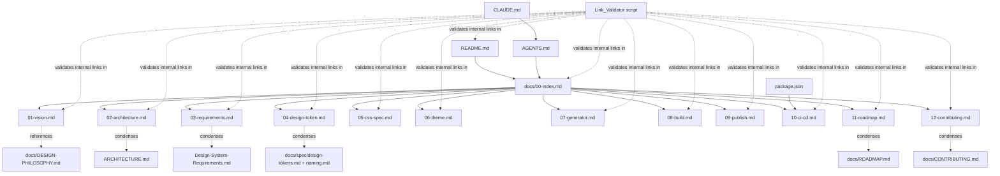

# Design Document

## Overview

This design describes how to produce the documentation-and-scaffold deliverable defined in `requirements.md`: a root `README.md`, thirteen numbered files under `docs/` (`00-index.md` through `12-contributing.md`), `AGENTS.md`, `CLAUDE.md`, and a root `package.json`. No `packages/*` source code is created by this feature — the platform's actual token pipeline, CSS core, generator, and CLI are future work tracked in `docs/11-roadmap.md`.

The repository already contains real reference material (`ARCHITECTURE.md`, `Design-System-Requirements.md`, the existing `AGENTS.md`, `docs/CHANGELOG.md`, `docs/CONTRIBUTING.md`, `docs/DESIGN-PHILOSOPHY.md`, `docs/ROADMAP.md`, `docs/spec/*.md`, `docs/diagrams/design-token-flow.md`). This design's guiding principle is: **reuse and reorganize, don't re-derive**. Every new file below states exactly which existing file(s) it condenses, restructures, or links out to, so content is written once and referenced everywhere else.

### Design Decision: Documentation Information Architecture

Requirement 18.3 treats `docs/00-index.md` through `docs/12-contributing.md` as **the** `Documentation_Set` — a single, internally consistent set of 13 files. To satisfy that while reusing existing content, this design adopts a **two-layer documentation model**:

1. **Numbered docs (`docs/00-*` – `docs/12-*`)** — the canonical, authoritative entry point for every topic named in `requirements.md`. Each numbered doc is a condensed, self-contained treatment of its topic that satisfies its Requirement's acceptance criteria directly (a reader should never need to leave the numbered set to satisfy an AC).
2. **Legacy / deep-reference files** (root `ARCHITECTURE.md`, root `Design-System-Requirements.md`, `docs/ROADMAP.md`, `docs/CONTRIBUTING.md`, `docs/DESIGN-PHILOSOPHY.md`, `docs/spec/*.md`, `docs/diagrams/*.md`, `docs/CHANGELOG.md`) — kept in place, **not deleted or rewritten** by this feature (that is a separate, future cleanup task). Each numbered doc that condenses one of these files includes a short **"Supersedes / Deep Reference"** note linking back to it, so nothing is lost and nothing is duplicated in two places that can drift apart.

This means:
- `docs/02-architecture.md` condenses `ARCHITECTURE.md` and links to it (and to `docs/diagrams/design-token-flow.md`) for full depth.
- `docs/03-requirements.md` restates `Design-System-Requirements.md` and links to it.
- `docs/04-design-token.md` summarizes and links to `docs/spec/design-tokens.md` and `docs/spec/naming.md`, which remain the deep specification layer.
- `docs/11-roadmap.md` restates the 9 milestones required by Requirement 13 (a different, coarser list than `docs/ROADMAP.md`'s 6 phases) and links to `docs/ROADMAP.md` for the detailed phase breakdown.
- `docs/12-contributing.md` becomes the canonical contributor entry point; `docs/CONTRIBUTING.md`'s content is reorganized into it, with a note pointing back to `docs/CONTRIBUTING.md` for now.
- `docs/01-vision.md` draws from `README.md`'s "Vision"/"Design Philosophy" sections and `docs/DESIGN-PHILOSOPHY.md`, since no numbered doc supersedes `DESIGN-PHILOSOPHY.md` directly (it is cited as a reference, not condensed).
- `docs/CHANGELOG.md` is untouched — it is not one of the 13 required files and is out of scope.

### Design Decision: AGENTS.md Reconciliation

The existing root `AGENTS.md` already defines a "Lead System Architect Agent" persona with mission, principles, review checklists, and standards. Requirement 15 asks for five specific, narrower things: directory structure, install/build/lint/test commands, doc-file locations, token/CSS constraints, and a pre-publish process. Three of these (directory structure, token/CSS constraints, and the general spirit of "review before acting") are **already covered** by the existing file's "Repository Rules" and "Core Principles" sections. Two are **missing** because they depend on artifacts that didn't exist before this feature (`package.json` scripts, `docs/09-publish.md`, `docs/10-ci-cd.md`).

Approach: **extend, don't replace**. The existing `AGENTS.md` persona, mission, and principles sections are preserved verbatim. This design adds:
1. An updated **"Source of Truth"** section that inserts `docs/00-index.md` as the entry point into the numbered Documentation_Set (ahead of the individual legacy files it links to).
2. A new **"Commands"** section listing the exact `pnpm` scripts from the new `package.json` (install, build, lint, test).
3. A new **"Before Publishing"** section describing the pre-publish process, cross-linking `docs/09-publish.md` and `docs/10-ci-cd.md`.

No existing heading is deleted or renumbered; new sections are inserted after "Repository Rules" so the persona-defining content stays at the top of the file.

## Architecture

### Deliverable Map



### Repository Layout After This Feature

```text
Repository/
├── README.md                     (rewritten)
├── ARCHITECTURE.md                (unchanged — legacy deep reference)
├── Design-System-Requirements.md  (unchanged — legacy deep reference)
├── AGENTS.md                      (extended, not replaced)
├── CLAUDE.md                      (new)
├── package.json                   (new)
├── docs/
│   ├── 00-index.md                (new)
│   ├── 01-vision.md               (new)
│   ├── 02-architecture.md         (new)
│   ├── 03-requirements.md         (new)
│   ├── 04-design-token.md         (new)
│   ├── 05-css-spec.md             (new)
│   ├── 06-theme.md                (new)
│   ├── 07-generator.md            (new)
│   ├── 08-build.md                (new)
│   ├── 09-publish.md              (new)
│   ├── 10-ci-cd.md                (new)
│   ├── 11-roadmap.md              (new)
│   ├── 12-contributing.md         (new)
│   ├── CHANGELOG.md               (unchanged)
│   ├── CONTRIBUTING.md            (unchanged — legacy deep reference)
│   ├── DESIGN-PHILOSOPHY.md       (unchanged — legacy reference)
│   ├── ROADMAP.md                 (unchanged — legacy deep reference)
│   ├── spec/                      (unchanged — deep specification layer)
│   └── diagrams/                  (unchanged — deep specification layer)
└── scripts/
    ├── validate-links.mjs         (new — Link_Validator implementation)
    └── validate-links.test.mjs    (new — unit + property tests)
```

`packages/`, `examples/`, and `.gitlab-ci.yml` are referenced by the documentation (per `ARCHITECTURE.md` and `Design-System-Requirements.md`) but are **not created** by this feature — they remain future scaffolding work, called out explicitly in `docs/11-roadmap.md` as not-yet-started milestones.

## Components and Interfaces

Each subsection below is one deliverable file. "Outline" gives the required section order (mapping directly to the file's acceptance criteria). "Sources" lists the existing files whose content is condensed or linked. "Links out" lists the `Internal_Link`s the file must contain.

### README.md (Requirement 1)

**Outline:**
1. Title + one-paragraph summary (AC 1.1)
2. "Goals" — shared CSS framework, design tokens, component standards, npm/NuGet/CDN publishing, automated CI/CD (AC 1.2)
3. "Supported Platforms" — full list of the 9 `Supported_Platform` entries (AC 1.3)
4. "Quick Start" — install + usage command examples (AC 1.4)
5. "Documentation" — Internal_Link to `docs/00-index.md` (AC 1.5)
6. "Repository Structure" — `packages/`, `examples/`, `docs/` (AC 1.6)
7. "License" (AC 1.7)

**Sources:** existing root `README.md` ("Overview", "Supported Platforms", "Repository Structure", "License" sections carry over almost directly); goals list sourced from `Design-System-Requirements.md#Goals`; quick-start commands sourced from `docs/CONTRIBUTING.md`'s local development setup (`corepack enable`, `pnpm install`, `pnpm build`), reframed as end-user quick start rather than contributor setup.

**Links out:** `docs/00-index.md`.

### docs/00-index.md (Requirement 2)

**Outline:**
1. Title
2. One table (or list) with exactly 13 rows, one per Documentation_Set file, each row = Internal_Link + one-sentence description
3. Rows ordered strictly by numeric filename prefix `00` → `12`

**Sources:** authored fresh — no existing file has this shape. Descriptions are one-sentence summaries of each numbered doc's purpose as defined in this design's outlines below.

**Links out:** all 13 `docs/00-*.md` – `docs/12-*.md` files (this is the only file that links to every other Documentation_Set member).

### docs/01-vision.md (Requirement 3)

**Outline:**
1. "Problem" — need for a single source of truth across multiple `Supported_Platform` entries
2. "Goals" — restates Requirement 1.2's goal list
3. "Audience & Use Cases"
4. "Non-Functional Priorities" — monorepo structure, semantic versioning, automated testing, backward compatibility

**Sources:** `README.md#Vision`, `README.md#Design Philosophy`, `docs/DESIGN-PHILOSOPHY.md#Philosophy` (the "Design once. Use everywhere." framing), `Design-System-Requirements.md#Vision` and `#Non-functional Requirements`.

**Links out:** none required by Requirement 3; `docs/00-index.md` back-link optional footer convention used by all docs.

### docs/02-architecture.md (Requirement 4)

**Outline:**
1. "Monorepo Layout" — `packages/tokens`, `packages/css-core`, `packages/generator`, `packages/cli`
2. "Data Flow" — Design_Token definitions → Generator tooling → Css_Specification output artifacts
3. "Platform Consumption" — how each `Supported_Platform` entry consumes generated output
4. Diagram — relationship between `packages/tokens`, `packages/css-core`, `packages/generator`, `packages/cli`, `examples/`
5. "Top-Level Directories" — responsibilities of `examples/` and `docs/`
6. "Supersedes / Deep Reference" note → `ARCHITECTURE.md`, `docs/diagrams/design-token-flow.md`

**Sources:** `ARCHITECTURE.md#High-Level Architecture`, `#Repository Architecture`, `#Design Token Architecture`; the diagram is adapted from `docs/diagrams/design-token-flow.md`'s Mermaid flowchart, trimmed to the package-level view Requirement 4.4 asks for.

**Links out:** `ARCHITECTURE.md`, `docs/diagrams/design-token-flow.md`.

### docs/03-requirements.md (Requirement 5)

**Outline:**
1. "Design Token Requirements" — colors, typography, spacing, radius, shadows, breakpoints, z-index, animations
2. "CSS Framework Requirements" — reset/base, utilities, responsive, dark mode, theme, RTL, print, accessibility
3. "Supported Platforms" — full list
4. "Distribution Channels" — full list
5. "Non-Functional Requirements" — monorepo, semver, unit tests, visual regression tests, documentation, performance, backward compatibility
6. Internal_Link back to `docs/01-vision.md`

**Sources:** `Design-System-Requirements.md` in full (Functional Requirements, Supported Platforms, Distribution, Non-functional Requirements sections map almost 1:1).

**Links out:** `docs/01-vision.md`, `Design-System-Requirements.md`.

### docs/04-design-token.md (Requirement 6)

**Outline:**
1. "File Format" — authored JSON structure
2. "Naming Convention" — `{category}.{group}.{variant}.{property}`
3. "Token Categories" — one example each: colors, typography, spacing, radius, shadows, breakpoints, z-index, animations
4. "Mapping to Output Formats" — CSS Custom Properties, JSON Tokens, TypeScript Types, Theme Files
5. "Validation Rules"
6. "Supersedes / Deep Reference" note → `docs/spec/design-tokens.md`, `docs/spec/naming.md`

**Sources:** `docs/spec/design-tokens.md` (already contains file format, one example per category, output mapping table, validation rules almost verbatim) and `docs/spec/naming.md` (naming convention). This doc is a condensation, not a rewrite — the spec files already satisfy this requirement in full detail.

**Links out:** `docs/spec/design-tokens.md`, `docs/spec/naming.md`, `docs/diagrams/design-token-flow.md`.

### docs/05-css-spec.md (Requirement 7)

**Outline:**
1. "Reset / Base Layer"
2. "Utility Class Naming" — convention + one example each for spacing, typography, color
3. "Responsive Strategy" — breakpoints and utility variation
4. "Dark Mode" — toggle mechanism + theme interaction
5. "RTL Support"
6. "Print Stylesheet"
7. "Accessibility Conventions" — focus states, color contrast

**Sources:** `docs/spec/naming.md#3. Utility Class Names` and `#Examples` table for the naming/examples; `ARCHITECTURE.md#CSS Architecture` for the reset → base → utilities → components → theme layering; `docs/spec/README.md#Specification Structure` for the planned `responsive.md`/`accessibility.md` scope (currently `Planned` status, so this doc states the intended strategy even though the detailed per-topic specs don't exist yet — flagged as "Planned" consistent with `docs/spec/README.md#Status`).

**Links out:** `docs/spec/naming.md`, `docs/spec/README.md`.

### docs/06-theme.md (Requirement 8)

**Outline:**
1. "Override Mechanism" — how a theme overrides default Design_Token values
2. "Light / Dark Structure"
3. "Example Custom Theme" — one complete example
4. "Runtime/Build-Time Activation" per `Supported_Platform`

**Sources:** `ARCHITECTURE.md#Theme Architecture` (CSS Custom Properties, example theme names: Light, Dark, Corporate, Banking, Insurance); `docs/spec/design-tokens.md#Mapping to Output Formats` ("Theme Files are produced by generating the full CSS Custom Property set once per theme... overriding only the tokens a theme redefines").

**Links out:** `ARCHITECTURE.md`, `docs/spec/design-tokens.md`.

### docs/07-generator.md (Requirement 9)

**Outline:**
1. "Inputs" — Design_Token definitions, Css_Specification source files
2. "Outputs per Platform"
3. "CLI" — invocation + one example command
4. "Adding a New Platform Target"
5. "Error Reporting" — behavior when a token fails validation

**Sources:** `docs/diagrams/design-token-flow.md` (stages 2–4: Token Parser & Validator, Semantic Token Graph, Transform Engine) for inputs/error-reporting; `ARCHITECTURE.md#Package Distribution` for outputs-per-platform framing; CLI section is authored fresh (no CLI exists yet) as a forward-looking design consistent with `packages/cli` in `ARCHITECTURE.md#Repository Architecture`.

**Links out:** `docs/diagrams/design-token-flow.md`, `docs/spec/design-tokens.md`.

### docs/08-build.md (Requirement 10)

**Outline:**
1. "Package Build Commands" — `tokens`, `css-core`, `generator`, `cli`
2. "Build Order & Dependencies" — `tokens` → `css-core` → `generator` → `cli`
3. "Build Output Locations"
4. "Building `examples/` Locally"

**Sources:** `docs/CONTRIBUTING.md#Local Development Setup` ("root scripts... orchestrate all packages in dependency order (`tokens` → `css-core` → `generator` → `cli`) via pnpm workspaces").

**Links out:** `docs/CONTRIBUTING.md`, `docs/12-contributing.md`.

### docs/09-publish.md (Requirement 11)

**Outline:**
1. "Publishing to npm (GitLab Package Registry)"
2. "Publishing to NuGet (GitLab Package Registry)"
3. "Publishing to CDN"
4. "Publishing Documentation (GitLab Pages)"
5. "Semantic Versioning Policy"
6. "Backward Compatibility Policy"

**Sources:** `ARCHITECTURE.md#Package Distribution`, `#Versioning Strategy`; `Design-System-Requirements.md#Distribution`; `docs/CHANGELOG.md#Versioning Policy` (Major/Minor/Patch definitions reused verbatim for consistency).

**Links out:** `docs/CHANGELOG.md`, `docs/10-ci-cd.md`.

### docs/10-ci-cd.md (Requirement 12)

**Outline:**
1. "Lint Stage" (includes the Link_Validator docs-lint check, see below)
2. "Test Stage" — unit tests + visual regression tests
3. "Build Stage"
4. "Publish Stage" — references every Distribution_Channel from `docs/09-publish.md`
5. "Deploy-Docs Stage"
6. "Stage Order" — lint → test → build → publish → deploy-docs
7. `.gitlab-ci.yml` root location reference (per AC 12.7, since this project uses GitLab CI per `ARCHITECTURE.md#CI/CD Pipeline`)

**Sources:** `ARCHITECTURE.md#CI/CD Pipeline` (Lint → Unit Test → Build → Bundle Size Check → Publish Packages → Release → Deploy Documentation, condensed to the 5 requirement-mandated stages); `Design-System-Requirements.md#CI/CD`.

**Links out:** `docs/09-publish.md`, `ARCHITECTURE.md`.

### docs/11-roadmap.md (Requirement 13)

**Outline:**
1. Milestone list, in order: Requirements, Architecture, Design Tokens, CSS Core, Generator, CI/CD, Documentation, VS Code Extension, v1.0 Release
2. Deliverable description per milestone
3. Status indicator per milestone (e.g. Done / In Progress / Planned)
4. "Supersedes / Deep Reference" note → `docs/ROADMAP.md`

**Sources:** `Design-System-Requirements.md#Milestones` for the exact 9-item ordered list; `docs/ROADMAP.md` for deliverable descriptions and status framing (its 6 "Phase" groupings map onto these 9 milestones, e.g. Phase 1 → Requirements/Architecture/Design Tokens, Phase 2 → CSS Core, etc.). This feature (the scaffold itself) is the first concrete evidence toward the "Documentation" milestone, so that milestone's status becomes "In Progress" once these files exist; all packages/*-dependent milestones remain "Planned".

**Links out:** `docs/ROADMAP.md`.

### docs/12-contributing.md (Requirement 14)

**Outline:**
1. "Local Development Setup"
2. "Branch Naming & Commit Conventions"
3. "Required Checks Before Merge" — lint, unit tests, visual regression tests
4. "Pull Request Review Process"
5. "Proposing a New or Modified Design Token"

**Sources:** `docs/CONTRIBUTING.md` in full — this existing file already satisfies all five ACs; the numbered doc reorganizes/condenses it into the required outline order and becomes the canonical link target from `docs/00-index.md`, with a note pointing back to `docs/CONTRIBUTING.md`.

**Links out:** `docs/CONTRIBUTING.md`, `docs/spec/design-tokens.md`, `docs/spec/naming.md`, `AGENTS.md`.

### AGENTS.md (Requirement 15)

**Outline (additions only — existing sections retained as-is):**
- *(existing)* Mission, Responsibilities, Project Vision
- *(updated)* "Source of Truth" — insert `docs/00-index.md` as entry point ahead of `ARCHITECTURE.md`
- *(existing)* Core Principles, Repository Rules
- *(new)* "Commands" — install/build/lint/test, sourced from `package.json` scripts (AC 15.2)
- *(new)* "Documentation Map" — location/purpose of each Documentation_Set file (AC 15.3), replacing the implicit assumption that only `ARCHITECTURE.md`/`README.md` exist
- *(existing)* Before Starting Any Task, Implementation Workflow, Architecture Review Checklist, Coding Standards
- *(existing)* "CSS Rules" already satisfies AC 15.4 (Design Token / CSS constraints) — retained verbatim
- *(new)* "Before Publishing" — pre-publish process (AC 15.5), cross-linking `docs/09-publish.md` and `docs/10-ci-cd.md`
- *(existing)* remaining sections (Documentation Rules, Testing Rules, Performance Budget, Security Rules, Versioning, Decision Making, Pull Request Review, Technical Debt, Communication, Definition of Done, Long-Term Objective)

**Sources:** existing root `AGENTS.md` (preserved), extended per the reconciliation decision above.

**Links out:** `docs/00-index.md`, `docs/09-publish.md`, `docs/10-ci-cd.md`.

### CLAUDE.md (Requirement 16)

**Outline:**
1. Title
2. Internal_Link to `AGENTS.md` + statement that its conventions apply to Claude-based agents
3. "Claude-Specific Notes" — tooling/invocation differences (e.g. how Claude Code should run the `pnpm` scripts and the `scripts/validate-links.mjs` check via its shell tool, any file-edit-tool conventions specific to Claude Code)
4. "Keeping This File Current" — states that any newly discovered Claude-specific difference must be added to this file immediately, not deferred (AC 16.4)

**Sources:** authored fresh; structurally mirrors `AGENTS.md`'s tone but stays short, per Requirement 16's narrow scope (it does not restate `AGENTS.md`, only links to it and calls out deltas).

**Links out:** `AGENTS.md`.

### package.json (Requirement 17)

**Schema:**

```json
{
  "name": "@company/design-system-platform",
  "version": "0.1.0",
  "license": "UNLICENSED",
  "private": true,
  "packageManager": "pnpm@9.0.0",
  "workspaces": [
    "packages/*",
    "examples/*"
  ],
  "scripts": {
    "lint": "pnpm run lint:docs",
    "lint:docs": "node scripts/validate-links.mjs",
    "test": "vitest run",
    "build": "echo \"no packages to build yet\" && exit 0",
    "publish": "echo \"no packages to publish yet\" && exit 0"
  },
  "devDependencies": {
    "vitest": "1.6.0",
    "fast-check": "3.19.0"
  }
}
```

**Field-by-field rationale:**
- `name`, `version`, `license` — required by AC 17.2. `license` is `"UNLICENSED"` matching `README.md#License`'s "Internal Company Use Only" stance; `private: true` reinforces this for tooling that respects it.
- `workspaces` — required by AC 17.3, exactly `packages/*` and `examples/*` per `ARCHITECTURE.md#Repository Architecture` and `Design-System-Requirements.md#Repository Structure`.
- `packageManager` — not required by Requirement 17 but included because `docs/CONTRIBUTING.md` mandates pnpm via Corepack; pinning it here is what makes that instruction enforceable.
- `scripts.lint` / `test` / `build` / `publish` — required by AC 17.4, corresponding to the lint/test/build/publish stages in `docs/10-ci-cd.md`. Because `packages/*` do not exist yet, `build` and `publish` are explicit no-op placeholders (documented as such in `docs/08-build.md` and `docs/09-publish.md`) rather than omitted, so the CI pipeline stages described in `docs/10-ci-cd.md` can run successfully today and be filled in incrementally as packages are scaffolded.
- `scripts.lint:docs` wires the Link_Validator (see below) into the lint stage, giving Requirement 18 an executable home inside the CI pipeline described in `docs/10-ci-cd.md`.

### Link_Validator (Requirement 18)

This is the one piece of executable code this feature delivers, because Requirement 18 asks for something that must run and produce a pass/fail result — a manual process cannot reliably keep 15 interlinked files consistent as they change.

**Implementation:** `scripts/validate-links.mjs`, a small dependency-free Node.js (ESM) script exporting pure, testable functions plus a CLI entry point:

```ts
// Pure, unit-testable core
interface InternalLink {
  sourceFile: string;   // repo-relative path of the file containing the link
  rawPath: string;      // the literal markdown link target, e.g. "./docs/01-vision.md"
  resolvedPath: string; // rawPath resolved relative to sourceFile's directory
  line: number;
}

function extractInternalLinks(fileContents: Map<string, string>): InternalLink[];
function findBrokenLinks(links: InternalLink[], existingFiles: Set<string>): InternalLink[];
function findOrphanedDocs(indexFile: string, docFiles: Set<string>, links: InternalLink[]): string[];
function checkIndexOrder(indexLinks: { prefix: number; rawPath: string }[]): { valid: boolean; outOfOrder: string[] };

// CLI entry point — reads the real filesystem, calls the pure functions above,
// prints violations, and exits 1 if any check fails.
async function main(): Promise<number>;
```

- `extractInternalLinks` scans every file in `README.md` and `docs/*.md` for markdown link syntax `[text](path)` and keeps only relative (non-`http`) paths — this satisfies the `Internal_Link` definition in the requirements Glossary.
- `findBrokenLinks` implements AC 18.1: a link is broken if its `resolvedPath` is not in the set of files that actually exist in the repository.
- `findOrphanedDocs` implements the checkable half of AC 18.2: a documentation file is orphaned if no link originating from `docs/00-index.md` resolves to it.
- `checkIndexOrder` implements AC 2.3 / AC 13.1's ordering rule as a reusable, general-purpose utility (not specific to the 13-file index — it also validates `docs/11-roadmap.md`'s milestone ordering).
- `main()` wires these together, runs them against the real repository tree, and is what `pnpm run lint:docs` invokes. It exits non-zero on any violation, which fails the lint stage of `docs/10-ci-cd.md`'s pipeline — this is how the check becomes a **CI check**, not a manual process.

Requirement 18.3 (consistent Glossary terminology across all 13 files) is **not** delegated to this script — reliably detecting synonym drift (e.g. "token" vs. "design token") requires human judgment, not pattern matching. It is instead handled as a Pull Request review item, called out explicitly in `docs/12-contributing.md`'s review process and in `AGENTS.md`'s Architecture Review Checklist.

## Data Models

```ts
// A single row in docs/00-index.md, and the general shape validated by checkIndexOrder
interface IndexEntry {
  prefix: number;        // numeric filename prefix, e.g. 4 for "04-design-token.md"
  fileName: string;       // "04-design-token.md"
  description: string;    // one-sentence summary
}

// The link graph the Link_Validator operates over
interface DocGraph {
  files: Set<string>;               // every repo-relative path considered part of the Documentation_Set + README.md
  links: InternalLink[];            // every extracted Internal_Link across those files
}

interface LinkValidationReport {
  brokenLinks: InternalLink[];
  orphanedDocs: string[];
  indexOrderViolations: string[];
  passed: boolean;                  // true iff all three arrays above are empty
}

// package.json's required shape (validated by a unit test, not a property test —
// there is exactly one authored package.json, not a space of inputs)
interface PackageManifestShape {
  name: string;
  version: string;
  license: string;
  workspaces: string[];             // must include "packages/*" and "examples/*"
  scripts: {
    lint: string;
    test: string;
    build: string;
    publish: string;
  };
}
```

## Correctness Properties

*A property is a characteristic or behavior that should hold true across all valid executions of a system-essentially, a formal statement about what the system should do. Properties serve as the bridge between human-readable specifications and machine-verifiable correctness guarantees.*

Most acceptance criteria in this feature describe fixed prose content in specific, individually-authored files (README structure, vision statement wording, roadmap milestones, etc.). Those are not properties — they are one-time content checks best verified by example-based unit tests reading the actual authored file. The exception is the `Link_Validator` (Requirement 18) and its shared ordering utility (also used by Requirement 2.3): these are small, pure functions whose correctness must hold for *any* set of files and links, not just the 15 files this feature happens to produce. That is what makes them suitable for property-based testing.

### Property 1: Index ordering check is correct

For any list of entries each carrying a numeric prefix, `checkIndexOrder` SHALL report `valid: true` if and only if the list is sorted in strictly ascending order by numeric prefix, and SHALL include in `outOfOrder` exactly the entries whose position violates that ascending order.

**Validates: Requirements 2.3, 13.1**

### Property 2: Broken internal link detection

For any set of files and any set of `Internal_Link` entries extracted from them (including links that resolve to a real file and links that do not), `findBrokenLinks` SHALL return exactly the subset of links whose `resolvedPath` is not a member of the given file set, and SHALL NOT return any link whose `resolvedPath` is a member of the given file set.

**Validates: Requirements 18.1**

### Property 3: Orphaned documentation file detection

For any set of documentation files and any set of `Internal_Link` entries originating from an index file, `findOrphanedDocs` SHALL return exactly the subset of documentation files that are not the `resolvedPath` target of any link originating from the index file.

**Validates: Requirements 18.2**

## Error Handling

- **Broken link found:** `main()` prints `sourceFile:line — broken link "rawPath" (resolved: resolvedPath)` for each entry in `brokenLinks`, then exits with status `1`. This fails the `lint` stage in `docs/10-ci-cd.md`, blocking merge per `docs/12-contributing.md`'s required checks.
- **Orphaned doc found:** `main()` prints `resolvedPath — not linked from docs/00-index.md`, exits `1`. Fixing this means either adding the missing link (satisfying AC 18.2) or removing the stray file.
- **Index or roadmap out of order:** `main()` prints the specific out-of-order file names from `checkIndexOrder`, exits `1`.
- **Malformed markdown link syntax:** `extractInternalLinks` skips any construct it cannot confidently parse as a link (rather than throwing), so a script bug never blocks CI on something unrelated to link integrity; it only ever flags paths it successfully extracted.
- **package.json is invalid JSON:** not handled by custom code — this is caught for free by `pnpm install`/`node -e "require('./package.json')"` failing loudly in CI before any script runs, which already satisfies AC 17.5 (a JSON parser raising a syntax error is itself the desired failure signal).
- **Script run outside repository root:** `main()` resolves all paths from `process.cwd()`; if `README.md` or `docs/` cannot be found, it prints a one-line usage error and exits `1` rather than silently reporting zero violations.

## Testing Strategy

**Unit tests (vitest), one per static content deliverable:**
- For each of `README.md` and the 13 numbered `docs/*.md` files: a test reads the real file and asserts the required headings/sections from that file's outline above are present, in the case of ordering-sensitive files (`00-index.md`, `11-roadmap.md`) asserting the specific required order.
- For `package.json`: a test `JSON.parse`s the file and asserts the `PackageManifestShape` fields exist with correct types (name/version/license are non-empty strings, `workspaces` includes `packages/*` and `examples/*`, `scripts` has `lint`/`test`/`build`/`publish`).
- For `AGENTS.md`: a test asserts both the preserved existing headings (e.g. "Mission", "CSS Rules") and the new required headings ("Commands", "Documentation Map", "Before Publishing") are present.
- For `CLAUDE.md`: a test asserts it links to `AGENTS.md` and contains the required sections.
- These are unit/example tests, not property tests — each targets exactly one fixed, authored file, per the PBT decision guide (behavior does not vary with input; there is only one input, the real file).

**Property tests (vitest + `fast-check`, minimum 100 iterations each), one per design property:**
- Each test lives alongside `scripts/validate-links.test.mjs`, generating arbitrary lists of entries / file sets / link sets (including edge cases: empty sets, duplicate prefixes, self-links, links with `../` traversal, links to non-markdown files) and asserting the corresponding pure function's output matches the property statement exactly.
- Tag format: **Feature: design-system-platform, Property {number}: {property text}**, placed as a comment directly above each `fc.assert(fc.property(...))` block.

**Manual review (not automated):**
- Requirement 18.3 (consistent Glossary terminology across the Documentation_Set) is a Pull Request review checklist item in `docs/12-contributing.md`, cross-referenced from `AGENTS.md`'s Architecture Review Checklist. It is explicitly out of scope for automated testing per the PBT decision guide (no reliable "for all inputs" statement can be written for synonym/terminology drift without NLP).
- Prose-quality acceptance criteria (e.g. "describes the problem", "provides at least one complete example") are verified by human read-through during PR review, backed by the unit tests' structural checks (the right heading exists) as a floor, not a ceiling.

**CI wiring:** `pnpm test` runs both the unit and property test suites; `pnpm run lint` (via `lint:docs`) runs the Link_Validator CLI directly against the real repository tree as an additional, independent check beyond the in-memory property tests — the property tests prove the *logic* is correct for all inputs, and the lint run proves the *current 15 files* satisfy that logic today.
