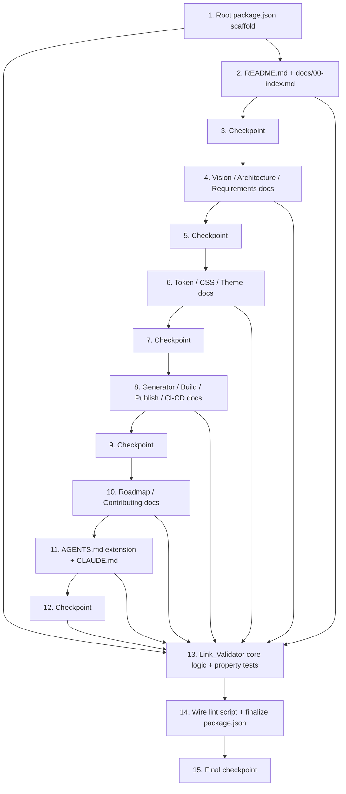

# Implementation Plan: Design System Platform (Documentation & Scaffold)

## Overview

This plan implements the documentation-and-scaffold deliverable from `design.md`: a root `README.md`, thirteen numbered files under `docs/` (`00-index.md`–`12-contributing.md`), an extended `AGENTS.md`, a new `CLAUDE.md`, a root `package.json`, and the `Link_Validator` (`scripts/validate-links.mjs`) with its unit and property tests. No `packages/*` source code is created — this is a documentation authoring and tooling-scaffolding feature.

Implementation language for the one piece of executable code (`Link_Validator`) is **Node.js (ESM)**, tested with **vitest** and **fast-check** (both specified explicitly in `design.md`, no language ambiguity to resolve). Each numbered doc condenses specific existing files per `design.md`'s "Sources" list — those source files must be read before authoring the corresponding doc.

## Task Dependency Graph



Docs authoring tasks (2, 4, 6, 8, 10, 11) can be parallelized by a team since each file is independently authored from its own source material, but the `Link_Validator` (13) and final lint wiring (14) must run after all link targets exist, since `findOrphanedDocs` and the CLI's real-filesystem check need every file in place to validate cleanly.

```json
{
  "waves": [
    { "wave": 1, "tasks": ["1"] },
    { "wave": 2, "tasks": ["2", "4", "6", "8", "10", "11"] },
    { "wave": 3, "tasks": ["3", "5", "7", "9", "12"] },
    { "wave": 4, "tasks": ["13"] },
    { "wave": 5, "tasks": ["14"] },
    { "wave": 6, "tasks": ["15"] }
  ]
}
```

## Tasks

- [x] 1. Set up root package.json and workspace scaffolding
  - Create root `package.json` per the schema in `design.md` (`name`, `version`, `license`, `private`, `packageManager`, `workspaces: ["packages/*", "examples/*"]`, `scripts.lint`/`lint:docs`/`test`/`build`/`publish`, `devDependencies` for `vitest` and `fast-check`)
  - Create `scripts/` directory
  - Run install to confirm the manifest resolves cleanly with the chosen package manager
  - _Requirements: 17.1, 17.2, 17.3_

  - [ ]* 1.2 Write unit test for package.json shape
    - Parse `package.json` with `JSON.parse` and assert `name`/`version`/`license` are non-empty strings, `workspaces` includes `packages/*` and `examples/*`, and `scripts` has `lint`, `test`, `build`, `publish`
    - _Requirements: 17.2, 17.3, 17.4, 17.5_

- [x] 2. Author README.md and Documentation Index
  - [x] 2.1 Rewrite root README.md
    - Read existing `README.md`, `Design-System-Requirements.md#Goals`, `docs/CONTRIBUTING.md` local setup section
    - Write title/summary, Goals, Supported Platforms (all 9), Quick Start, Documentation link to `docs/00-index.md`, Repository Structure (`packages/`, `examples/`, `docs/`), License
    - _Requirements: 1.1, 1.2, 1.3, 1.4, 1.5, 1.6, 1.7_

  - [ ]* 2.2 Write unit test for README.md structure
    - Assert each required section/heading from 2.1 is present, including the Internal_Link to `docs/00-index.md`
    - _Requirements: 1.1, 1.2, 1.3, 1.4, 1.5, 1.6, 1.7_

  - [x] 2.3 Author docs/00-index.md
    - Write a table/list with exactly 13 rows, one per Documentation_Set file, each with an Internal_Link and one-sentence description, ordered strictly `00` → `12`
    - _Requirements: 2.1, 2.2, 2.3_

  - [ ]* 2.4 Write unit test for docs/00-index.md structure and order
    - Assert all 13 links are present and appear in strict ascending numeric-prefix order
    - _Requirements: 2.1, 2.2, 2.3_

- [x] 3. Checkpoint - Ensure README and index tests pass
  - Ensure all tests pass, ask the user if questions arise.

- [x] 4. Author Vision, Architecture, and Requirements docs
  - [x] 4.1 Author docs/01-vision.md
    - Read `README.md#Vision`, `README.md#Design Philosophy`, `docs/DESIGN-PHILOSOPHY.md#Philosophy`, `Design-System-Requirements.md#Vision` and `#Non-functional Requirements`
    - Write Problem, Goals (restating Req 1.2's list), Audience & Use Cases, Non-Functional Priorities
    - _Requirements: 3.1, 3.2, 3.3, 3.4_

  - [ ]* 4.2 Write unit test for docs/01-vision.md structure
    - Assert Problem, Goals, Audience & Use Cases, Non-Functional Priorities sections are present
    - _Requirements: 3.1, 3.2, 3.3, 3.4_

  - [x] 4.3 Author docs/02-architecture.md
    - Read `ARCHITECTURE.md#High-Level Architecture`, `#Repository Architecture`, `#Design Token Architecture`, `docs/diagrams/design-token-flow.md`
    - Write Monorepo Layout, Data Flow, Platform Consumption, a Mermaid diagram of `packages/tokens`/`packages/css-core`/`packages/generator`/`packages/cli`/`examples/`, Top-Level Directories, and a "Supersedes / Deep Reference" note linking `ARCHITECTURE.md` and `docs/diagrams/design-token-flow.md`
    - _Requirements: 4.1, 4.2, 4.3, 4.4, 4.5_

  - [ ]* 4.4 Write unit test for docs/02-architecture.md structure
    - Assert Monorepo Layout, Data Flow, Platform Consumption, diagram presence, Top-Level Directories sections and both deep-reference links are present
    - _Requirements: 4.1, 4.2, 4.3, 4.4, 4.5_

  - [x] 4.5 Author docs/03-requirements.md
    - Read `Design-System-Requirements.md` in full
    - Write Design Token Requirements, CSS Framework Requirements, Supported Platforms (all), Distribution Channels (all), Non-Functional Requirements, and an Internal_Link back to `docs/01-vision.md`
    - _Requirements: 5.1, 5.2, 5.3, 5.4, 5.5, 5.6_

  - [ ]* 4.6 Write unit test for docs/03-requirements.md structure
    - Assert all six required sections/link are present, including all 9 Supported_Platform entries and all 4 Distribution_Channel entries
    - _Requirements: 5.1, 5.2, 5.3, 5.4, 5.5, 5.6_

- [x] 5. Checkpoint - Ensure vision/architecture/requirements docs tests pass
  - Ensure all tests pass, ask the user if questions arise.

- [x] 6. Author Design Token, CSS Spec, and Theme docs
  - [x] 6.1 Author docs/04-design-token.md
    - Read `docs/spec/design-tokens.md` and `docs/spec/naming.md`
    - Write File Format, Naming Convention, Token Categories (one example each for all 8 categories), Mapping to Output Formats, Validation Rules, and a "Supersedes / Deep Reference" note linking both spec files
    - _Requirements: 6.1, 6.2, 6.3, 6.4, 6.5_

  - [ ]* 6.2 Write unit test for docs/04-design-token.md structure
    - Assert File Format, Naming Convention, all 8 token category examples, Mapping to Output Formats, Validation Rules sections, and deep-reference links are present
    - _Requirements: 6.1, 6.2, 6.3, 6.4, 6.5_

  - [x] 6.3 Author docs/05-css-spec.md
    - Read `docs/spec/naming.md#3. Utility Class Names`, `ARCHITECTURE.md#CSS Architecture`, `docs/spec/README.md#Specification Structure`
    - Write Reset/Base Layer, Utility Class Naming (with spacing/typography/color examples), Responsive Strategy, Dark Mode, RTL Support, Print Stylesheet, Accessibility Conventions
    - _Requirements: 7.1, 7.2, 7.3, 7.4, 7.5, 7.6, 7.7_

  - [ ]* 6.4 Write unit test for docs/05-css-spec.md structure
    - Assert all 7 required sections are present, including the 3 utility class examples (spacing, typography, color)
    - _Requirements: 7.1, 7.2, 7.3, 7.4, 7.5, 7.6, 7.7_

  - [x] 6.5 Author docs/06-theme.md
    - Read `ARCHITECTURE.md#Theme Architecture`, `docs/spec/design-tokens.md#Mapping to Output Formats`
    - Write Override Mechanism, Light/Dark Structure, Example Custom Theme (complete example), Runtime/Build-Time Activation per Supported_Platform
    - _Requirements: 8.1, 8.2, 8.3, 8.4_

  - [ ]* 6.6 Write unit test for docs/06-theme.md structure
    - Assert all 4 required sections are present, including a complete custom theme example
    - _Requirements: 8.1, 8.2, 8.3, 8.4_

- [x] 7. Checkpoint - Ensure token/css/theme docs tests pass
  - Ensure all tests pass, ask the user if questions arise.

- [x] 8. Author Generator, Build, Publish, and CI/CD docs
  - [x] 8.1 Author docs/07-generator.md
    - Read `docs/diagrams/design-token-flow.md` (stages 2–4), `ARCHITECTURE.md#Package Distribution`
    - Write Inputs, Outputs per Platform, CLI (with example command), Adding a New Platform Target, Error Reporting
    - _Requirements: 9.1, 9.2, 9.3, 9.4, 9.5_

  - [ ]* 8.2 Write unit test for docs/07-generator.md structure
    - Assert all 5 required sections are present, including a CLI example command
    - _Requirements: 9.1, 9.2, 9.3, 9.4, 9.5_

  - [x] 8.3 Author docs/08-build.md
    - Read `docs/CONTRIBUTING.md#Local Development Setup`
    - Write Package Build Commands (`tokens`, `css-core`, `generator`, `cli`), Build Order & Dependencies, Build Output Locations, Building `examples/` Locally
    - _Requirements: 10.1, 10.2, 10.3, 10.4_

  - [ ]* 8.4 Write unit test for docs/08-build.md structure
    - Assert all 4 required sections are present, including all 4 package build commands
    - _Requirements: 10.1, 10.2, 10.3, 10.4_

  - [x] 8.5 Author docs/09-publish.md
    - Read `ARCHITECTURE.md#Package Distribution`, `#Versioning Strategy`, `Design-System-Requirements.md#Distribution`, `docs/CHANGELOG.md#Versioning Policy`
    - Write Publishing to npm, Publishing to NuGet, Publishing to CDN, Publishing Documentation (GitLab Pages), Semantic Versioning Policy, Backward Compatibility Policy
    - _Requirements: 11.1, 11.2, 11.3, 11.4, 11.5, 11.6_

  - [ ]* 8.6 Write unit test for docs/09-publish.md structure
    - Assert all 6 required sections are present
    - _Requirements: 11.1, 11.2, 11.3, 11.4, 11.5, 11.6_

  - [x] 8.7 Author docs/10-ci-cd.md
    - Read `ARCHITECTURE.md#CI/CD Pipeline`, `Design-System-Requirements.md#CI/CD`
    - Write Lint Stage, Test Stage, Build Stage, Publish Stage (referencing every Distribution_Channel from `docs/09-publish.md`), Deploy-Docs Stage, Stage Order, and a `.gitlab-ci.yml` root-location reference (since the pipeline is GitLab CI per `ARCHITECTURE.md`)
    - _Requirements: 12.1, 12.2, 12.3, 12.4, 12.5, 12.6, 12.7, 12.8_

  - [ ]* 8.8 Write unit test for docs/10-ci-cd.md structure
    - Assert all 6 stage sections, the stage-order statement, and the `.gitlab-ci.yml` reference are present
    - _Requirements: 12.1, 12.2, 12.3, 12.4, 12.5, 12.6, 12.7, 12.8_

- [x] 9. Checkpoint - Ensure generator/build/publish/ci-cd docs tests pass
  - Ensure all tests pass, ask the user if questions arise.

- [x] 10. Author Roadmap and Contributing docs
  - [x] 10.1 Author docs/11-roadmap.md
    - Read `Design-System-Requirements.md#Milestones`, `docs/ROADMAP.md`
    - Write the 9-milestone list in required order (Requirements, Architecture, Design Tokens, CSS Core, Generator, CI/CD, Documentation, VS Code Extension, v1.0 Release) with deliverable description and status indicator per milestone, and a "Supersedes / Deep Reference" note linking `docs/ROADMAP.md`
    - _Requirements: 13.1, 13.2, 13.3_

  - [ ]* 10.2 Write property test for docs/11-roadmap.md milestone ordering
    - **Property 1: Index ordering check is correct**
    - Reuse `checkIndexOrder` against the roadmap's milestone list to confirm strict ordering
    - **Validates: Requirements 13.1**

  - [ ]* 10.3 Write unit test for docs/11-roadmap.md structure
    - Assert all 9 milestones appear in required order, each with a deliverable description and status indicator, plus the deep-reference note
    - _Requirements: 13.1, 13.2, 13.3_

  - [x] 10.4 Author docs/12-contributing.md
    - Read `docs/CONTRIBUTING.md` in full
    - Write Local Development Setup, Branch Naming & Commit Conventions, Required Checks Before Merge (lint, unit tests, visual regression tests), Pull Request Review Process, Proposing a New/Modified Design Token
    - _Requirements: 14.1, 14.2, 14.3, 14.4, 14.5_

  - [ ]* 10.5 Write unit test for docs/12-contributing.md structure
    - Assert all 5 required sections are present
    - _Requirements: 14.1, 14.2, 14.3, 14.4, 14.5_

- [x] 11. Extend AGENTS.md and create CLAUDE.md
  - [x] 11.1 Extend AGENTS.md
    - Preserve all existing sections verbatim (Mission, Responsibilities, Project Vision, Core Principles, Repository Rules, etc.)
    - Update "Source of Truth" to insert `docs/00-index.md` ahead of the legacy files it links to
    - Insert new "Commands" section (install/build/lint/test, sourced from `package.json` scripts) after "Repository Rules"
    - Insert new "Documentation Map" section (location/purpose of each Documentation_Set file)
    - Insert new "Before Publishing" section, cross-linking `docs/09-publish.md` and `docs/10-ci-cd.md`
    - Confirm "CSS Rules" section (already satisfies token/CSS constraints) remains untouched
    - _Requirements: 15.1, 15.2, 15.3, 15.4, 15.5_

  - [ ]* 11.2 Write unit test for AGENTS.md structure
    - Assert both preserved existing headings (e.g. "Mission", "CSS Rules") and new required headings ("Commands", "Documentation Map", "Before Publishing") are present
    - _Requirements: 15.1, 15.2, 15.3, 15.4, 15.5_

  - [x] 11.3 Create CLAUDE.md
    - Write Title, Internal_Link to `AGENTS.md` with a statement that its conventions apply to Claude-based agents, "Claude-Specific Notes" section, and "Keeping This File Current" section
    - _Requirements: 16.1, 16.2, 16.3, 16.4_

  - [ ]* 11.4 Write unit test for CLAUDE.md structure
    - Assert the Internal_Link to `AGENTS.md`, the applicability statement, and both required sections are present
    - _Requirements: 16.1, 16.2, 16.3, 16.4_

- [x] 12. Checkpoint - Ensure roadmap/contributing/AGENTS/CLAUDE tests pass
  - Ensure all tests pass, ask the user if questions arise.

- [x] 13. Implement Link_Validator core logic and property tests
  - [x] 13.1 Implement extractInternalLinks and findBrokenLinks
    - Create `scripts/validate-links.mjs` (Node.js ESM)
    - Implement `extractInternalLinks(fileContents: Map<string, string>): InternalLink[]` scanning markdown link syntax `[text](path)`, keeping only relative (non-`http`) paths, skipping unparseable constructs instead of throwing
    - Implement `findBrokenLinks(links: InternalLink[], existingFiles: Set<string>): InternalLink[]`
    - _Requirements: 18.1_

  - [ ]* 13.2 Write property test for findBrokenLinks
    - **Property 2: Broken internal link detection**
    - Generate arbitrary file sets and link sets (including links that resolve and links that don't, self-links, `../` traversal) with fast-check, min 100 iterations
    - **Validates: Requirements 18.1**

  - [x] 13.3 Implement findOrphanedDocs
    - Implement `findOrphanedDocs(indexFile: string, docFiles: Set<string>, links: InternalLink[]): string[]`
    - _Requirements: 18.2_

  - [ ]* 13.4 Write property test for findOrphanedDocs
    - **Property 3: Orphaned documentation file detection**
    - Generate arbitrary doc file sets and index-originating link sets with fast-check, min 100 iterations
    - **Validates: Requirements 18.2**

  - [x] 13.5 Implement checkIndexOrder
    - Implement `checkIndexOrder(indexLinks: { prefix: number; rawPath: string }[]): { valid: boolean; outOfOrder: string[] }`
    - _Requirements: 2.3, 13.1_

  - [ ]* 13.6 Write property test for checkIndexOrder
    - **Property 1: Index ordering check is correct**
    - Generate arbitrary lists of entries with numeric prefixes (including duplicates and out-of-order lists) with fast-check, min 100 iterations
    - **Validates: Requirements 2.3, 13.1**

  - [x] 13.7 Implement main() CLI entry point
    - Wire `extractInternalLinks`, `findBrokenLinks`, `findOrphanedDocs`, and `checkIndexOrder` together against the real filesystem (`README.md` + `docs/*.md`)
    - Print violation messages per the Error Handling section of `design.md` and exit `1` on any violation, `0` otherwise
    - Handle the "run outside repository root" case with a one-line usage error and exit `1`
    - _Requirements: 18.1, 18.2_

  - [ ]* 13.8 Write unit test for main() against the real repository tree
    - Run `main()` against the actual authored files from tasks 2, 4, 6, 8, 10, 11 and assert it exits `0` with no violations
    - _Requirements: 18.1, 18.2_

- [x] 14. Wire lint script and finalize package.json
  - [x] 14.1 Confirm package.json scripts invoke the Link_Validator and test suite correctly
    - Verify `scripts.lint`/`lint:docs` invokes `node scripts/validate-links.mjs`, `scripts.test` invokes `vitest run`
    - _Requirements: 17.4_

  - [ ]* 14.2 Write unit test verifying package.json script wiring
    - Assert `scripts.lint`/`lint:docs`/`test`/`build`/`publish` values match the expected commands
    - _Requirements: 17.4_

- [x] 15. Final checkpoint - Ensure all tests and lint pass
  - Run the full unit test suite, property test suite, and `node scripts/validate-links.mjs` against the real repository tree; ensure everything passes, ask the user if questions arise.

## Notes

- Tasks marked with `*` are optional and can be skipped for faster MVP; they are unit/property tests and are not implemented by the coding agent by default.
- Each task references specific requirement clauses (not just user stories) for traceability.
- Checkpoints (3, 5, 7, 9, 12, 15) validate incremental progress and give natural pause points for review.
- Property tests (Properties 1–3) validate the three pure, universally-quantified functions in the Link_Validator; all other acceptance criteria are static-content checks covered by unit tests, per `design.md`'s Testing Strategy.
- Task 13 (Link_Validator) is placed after all documentation-authoring tasks in execution order because its unit test (13.8) and the final lint run (15) validate against the real, fully-authored file set — but its pure-function implementation and property tests (13.1–13.6) have no such dependency and may be implemented earlier if convenient.
