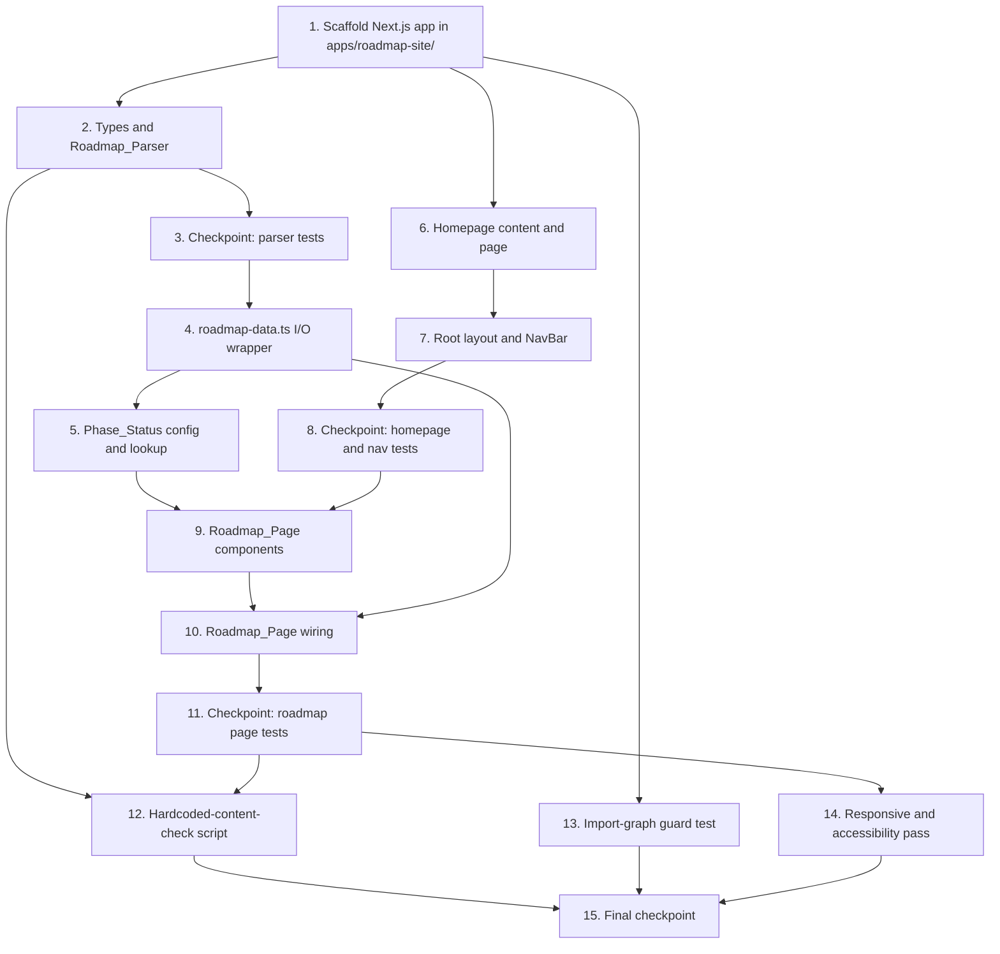

# Implementation Plan: Roadmap_Site (Roadmap & Homepage Site)

## Overview

This plan builds the standalone `apps/roadmap-site/` Next.js (App Router) + TypeScript application incrementally: scaffolding first, then the pure `Roadmap_Parser` (with property tests) before anything depends on it, then the I/O wrapper and `Phase_Status` config, then the Homepage, then shared layout/navigation, then the Roadmap_Page and its components, then the hardcoded-content guard, then the import-graph guard, then a final responsive/accessibility pass. Each task wires directly into what was built before it — nothing is left orphaned.

Package management uses `pnpm`, per project convention (see `docs/CONTRIBUTING.md`). TypeScript strict mode is enabled from scaffolding onward. Property tests use Vitest + `fast-check`, minimum 100 iterations each, tagged per the design's `**Feature: roadmap-homepage-site, Property {number}: {property text}**` format.

## Task Dependency Graph



```json
{
  "waves": [
    { "wave": 1, "tasks": ["1"] },
    { "wave": 2, "tasks": ["2", "6", "13"] },
    { "wave": 3, "tasks": ["3", "7"] },
    { "wave": 4, "tasks": ["4", "8"] },
    { "wave": 5, "tasks": ["5", "9"] },
    { "wave": 6, "tasks": ["10"] },
    { "wave": 7, "tasks": ["11"] },
    { "wave": 8, "tasks": ["12", "14"] },
    { "wave": 9, "tasks": ["15"] }
  ]
}
```

## Tasks

- [x] 1. Scaffold the Next.js app in `apps/roadmap-site/`
  - Create `apps/roadmap-site/` as a sibling of `packages/`, `docs/`, `examples/`, `scripts/`, with its own `package.json` (no workspace reference to any `packages/*` package)
  - Configure Next.js App Router + TypeScript (`next.config.ts`, `tsconfig.json` with strict mode)
  - Configure Tailwind CSS (`tailwind.config.ts`, `src/app/globals.css` as the Tailwind entrypoint only)
  - Set up Vitest and `fast-check` as dev dependencies, with a test script and a `src/lib/__tests__/` directory
  - Add ESLint config with the `jsx-a11y/alt-text` rule enabled
  - _Requirements: 1.1, 1.2, 1.3, 1.4_

- [x] 2. Implement core data types and the `Roadmap_Parser` pure function
  - [x] 2.1 Implement `src/lib/types.ts`
    - Define `Phase`, `FutureRoadmapItem`, `RoadmapData`, `PhaseStatus`, `PhaseStatusConfig`, `HomepageContent`
    - _Requirements: 3.2, 3.3_

  - [x] 2.2 Implement `src/lib/roadmap-parser.ts`
    - Add `mdast-util-from-markdown` as a dependency
    - Implement `parseRoadmap(markdown: string): RoadmapData` as a pure function with no file I/O: split top-level AST nodes into segments at depth-1 headings, identify Phase segments via the `/^Phase\s+\d+\s*[—-]\s*.+/` heading pattern, extract Objective/Deliverables/Success Criteria subsections in source order, identify the "Future Roadmap" segment and extract its bullet list
    - Throw `` Roadmap parse error: Phase "<phase name>" is missing a required "<Objective|Deliverables|Success Criteria>" section. `` when a recognized Phase segment is missing or has an empty required subsection
    - _Requirements: 3.2, 3.3, 3.4, 3.6_

  - [ ]* 2.3 Write property test for Property 1
    - **Property 1: Parsing produces a complete, ordered Phase list**
    - **Validates: Requirements 3.2, 3.4**
    - Generate arbitrary well-formed documents with varying Phase count, deliverable/success-criteria counts, and text content, in `src/lib/__tests__/roadmap-parser.test.ts`

  - [ ]* 2.4 Write property test for Property 2
    - **Property 2: Future Roadmap items are extracted completely and in order**
    - **Validates: Requirements 3.3**
    - Generate arbitrary "Future Roadmap" bullet lists of varying length and content

  - [ ]* 2.5 Write property test for Property 5
    - **Property 5: Malformed Phase sections are always rejected with an identifying error**
    - **Validates: Requirements 3.6**
    - Generate documents with exactly one of Objective/Deliverables/Success Criteria randomly omitted or emptied from a Phase-like heading, and assert `parseRoadmap` throws with the Phase's heading text in the message

  - [ ]* 2.6 Write unit tests for `roadmap-parser.ts` edge cases
    - Non-Phase `#` headings (e.g. `# Vision`, `# Roadmap Governance`) are skipped, not treated as malformed Phases
    - Multiple Phases with a mix of recognized and unrecognized headings interleaved
    - _Requirements: 3.2, 3.4_

- [x] 3. Checkpoint - Ensure all parser tests pass
  - Ensure all tests pass, ask the user if questions arise.

- [x] 4. Implement `roadmap-data.ts` I/O wrapper
  - [x] 4.1 Implement `src/lib/roadmap-data.ts`
    - Resolve the absolute path to `docs/ROADMAP.md` relative to the repository root
    - Implement `getRoadmapData(): RoadmapData` that checks file existence, throws `` Roadmap content source not found. Expected file at: <resolvedAbsolutePath> `` if absent, otherwise reads the file with `fs.readFileSync` and calls `parseRoadmap`, letting parser exceptions propagate unchanged
    - _Requirements: 3.1, 3.5_

  - [ ]* 4.2 Write unit tests for `roadmap-data.ts`
    - With the real `docs/ROADMAP.md`, assert `getRoadmapData()` reads and parses it successfully
    - With a mocked/nonexistent path, assert it throws the exact "not found" message shape identifying that path
    - _Requirements: 3.1, 3.5_

- [x] 5. Implement `Phase_Status` configuration and lookup
  - [x] 5.1 Implement `src/content/phase-status.config.ts` and `src/lib/phase-status.ts`
    - Define `phaseStatusConfig: PhaseStatusConfig` keyed by exact Phase name strings
    - Implement `getPhaseStatus(name: string, config = phaseStatusConfig): PhaseStatus | undefined` as a pure lookup
    - _Requirements: 4.5, 4.6_

  - [ ]* 5.2 Write property test for Property 4
    - **Property 4: Status indicator presence matches configuration exactly**
    - **Validates: Requirements 4.5, 4.6**
    - Generate arbitrary Phase names and arbitrary `PhaseStatusConfig` maps, asserting the lookup returns the configured status if and only if an exact-name entry exists, in `src/lib/__tests__/phase-status.test.ts`

  - [ ]* 5.3 Write unit tests for `getPhaseStatus` edge cases
    - Stale config entry for a phase name not present in current data has no effect
    - Config with no matching entry returns `undefined`
    - _Requirements: 4.6_

- [x] 6. Implement Homepage content module and page
  - [x] 6.1 Implement `src/content/homepage-content.ts`
    - Author `homepageContent: HomepageContent` (platform name, overview, vision, supported platforms) mirroring `README.md`'s Overview/Vision/Supported Platforms sections
    - _Requirements: 2.1, 2.2, 2.3, 2.4_

  - [x] 6.2 Implement `src/components/SupportedPlatformsList.tsx`
    - Render a `<ul>` of supported platform names from a `platforms: string[]` prop
    - _Requirements: 2.4_

  - [x] 6.3 Implement `src/app/page.tsx` (Homepage)
    - Server Component importing `homepageContent`; render platform name as `<h1>`, Overview `<section>`, Vision `<section>`, `<SupportedPlatformsList>`, and a `<Link href="/roadmap">`
    - _Requirements: 2.1, 2.2, 2.3, 2.4, 2.5_

  - [ ]* 6.4 Write unit tests for Homepage content and rendering
    - Assert rendered output contains the platform name, overview text, vision text, supported-platforms list, and a link to `/roadmap`
    - _Requirements: 2.1, 2.2, 2.3, 2.4, 2.5_

- [x] 7. Implement root layout and `NavBar`
  - [x] 7.1 Implement `src/components/NavBar.tsx`
    - Render `<nav aria-label="Primary">` with `next/link` `<Link>`s to `/` and `/roadmap`
    - _Requirements: 5.1, 5.2, 5.3, 5.4_

  - [x] 7.2 Implement `src/app/layout.tsx`
    - Root layout rendering `<html>`/`<body>`, `<NavBar />`, and `<main>{children}</main>` so navigation appears on every page
    - _Requirements: 5.1, 5.2, 8.1_

  - [ ]* 7.3 Write unit tests for `NavBar` and root layout
    - Assert `NavBar`'s rendered output contains a link to `/` and a link to `/roadmap`
    - Assert the layout renders exactly one `<nav>` and one `<main>`
    - _Requirements: 5.1, 5.2, 8.1_

- [x] 8. Checkpoint - Ensure all Homepage and navigation tests pass
  - Ensure all tests pass, ask the user if questions arise.

- [x] 9. Implement Roadmap_Page presentational components
  - [x] 9.1 Implement `src/components/StatusBadge.tsx`
    - Render an icon (`aria-hidden="true"`) and a visible text label ("Completed" / "In Progress" / "Planned") together for a `status: PhaseStatus` prop, color as a supplementary cue only
    - _Requirements: 8.2_

  - [ ]* 9.2 Write unit tests for `StatusBadge`
    - For each of the three `PhaseStatus` values, assert the rendered output contains the corresponding visible text label
    - _Requirements: 8.2_

  - [x] 9.3 Implement `src/components/PhaseCard.tsx`
    - Render `<article>` with `<h2>` name (+ optional `<StatusBadge>` when `status` prop is provided), `<h3>Objective</h3><p>`, `<h3>Deliverables</h3><ul>`, `<h3>Success Criteria</h3><ul>`
    - Apply `lg:grid lg:grid-cols-2 lg:gap-x-8` to the Deliverables/Success Criteria lists for the desktop multi-column layout, stacked single-column below `lg:`
    - _Requirements: 4.2, 4.5, 4.6, 6.2, 8.1, 8.2_

  - [x] 9.4 Implement `src/components/FutureRoadmapSection.tsx`
    - Render `items: FutureRoadmapItem[]` inside an `<aside aria-labelledby="future-roadmap-heading">` with its own `<h2 id="future-roadmap-heading">`, structurally distinct from `PhaseCard`
    - _Requirements: 4.4, 8.1_

  - [ ]* 9.5 Write property test for Property 3
    - **Property 3: Roadmap_Page renders every phase's complete content in source order**
    - **Validates: Requirements 4.1, 4.2, 4.3**
    - Generate arbitrary non-empty `Phase[]` lists (arbitrary name/objective/deliverables/successCriteria), render the phase list with `react-dom/server`, and assert every phase's name/objective/deliverables/success-criteria text appears in the output in the same order as the input array, in `src/lib/__tests__/roadmap-parser.test.ts` or a dedicated `phase-list-render.test.ts`

  - [ ]* 9.6 Write unit tests for `FutureRoadmapSection` and `PhaseCard`
    - Assert `FutureRoadmapSection`'s items render inside an `<aside>` distinct from any `<PhaseCard>` container
    - Assert a `PhaseCard` rendered without a `status` prop displays no status indicator
    - _Requirements: 4.4, 4.6_

- [x] 10. Implement Roadmap_Page
  - [x] 10.1 Implement `src/app/roadmap/page.tsx`
    - Server Component calling `getRoadmapData()` at module scope; map `phases` in array order to `<PhaseCard>`, passing each phase's `getPhaseStatus(phase.name)` result as `status`; render `<h1>Roadmap</h1>` and `<FutureRoadmapSection items={futureRoadmapItems} />`
    - _Requirements: 4.1, 4.2, 4.3, 4.5, 4.6_

  - [ ]* 10.2 Write unit tests for Roadmap_Page rendering
    - Assert the page renders exactly one `<h1>`, and that Future_Roadmap_Items render only when present
    - _Requirements: 4.1, 4.4, 8.1_

- [x] 11. Checkpoint - Ensure all Roadmap_Page tests pass
  - Ensure all tests pass, ask the user if questions arise.

- [x] 12. Implement the hardcoded-content-check script
  - [x] 12.1 Implement the core detection function in `scripts/check-hardcoded-roadmap-content.ts`
    - Parse the current `docs/ROADMAP.md` with `parseRoadmap`, build the "sensitive strings" set (every Phase name, objective, deliverable, success-criterion, trimmed, length-filtered to 8+ characters)
    - Glob `.ts`/`.tsx` files under `src/app/`, `src/components/`, and `src/content/` (excluding `phase-status.config.ts` and `__tests__` directories), search each file's text for sensitive strings as literal substrings, allowlisting bare Phase-name-only matches inside `phase-status.config.ts`
    - Print `` Hardcoded roadmap content detected in <file>: "<matched text>" duplicates docs/ROADMAP.md content. Remove the hardcoded copy and source it from the Roadmap_Parser instead. `` for every match and exit `1`; exit `0` when no match is found
    - _Requirements: 7.1, 7.2, 7.3, 7.4_

  - [ ]* 12.2 Write property test for Property 6
    - **Property 6: Hardcoded-content detection matches substring presence exactly**
    - **Validates: Requirements 7.2**
    - Generate arbitrary sensitive-string sets (length 8+) and arbitrary source file text, including constructed matches and non-matches and the `phase-status.config.ts` allowlist path case, in `src/lib/__tests__/hardcoded-content-check.test.ts`

  - [ ]* 12.3 Write integration-style unit test for the full script behavior
    - Seed a temporary fixture file containing a copy-pasted deliverable string from `docs/ROADMAP.md`, run the script's core check function against it, and assert it reports a violation
    - _Requirements: 7.4_

  - [x] 12.4 Wire the script as `prebuild` in `apps/roadmap-site/package.json`
    - Add `"prebuild": "tsx scripts/check-hardcoded-roadmap-content.ts"` so it runs automatically before `"build": "next build"`
    - _Requirements: 7.4_

- [x] 13. Implement the import-graph guard test
  - [ ]* 13.1 Write a unit test asserting no file under `apps/roadmap-site/src/` or `apps/roadmap-site/scripts/` imports from `packages/`
    - Scan source files' import statements/specifiers for any path resolving into `packages/`
    - _Requirements: 1.3, 1.4_

- [x] 14. Responsive and accessibility pass
  - [x] 14.1 Apply page-level responsive container styling
    - Apply `max-w-screen-xl mx-auto px-4` to Homepage and Roadmap_Page containers; verify no fixed pixel widths or `whitespace-nowrap` usage that could force horizontal scroll from 320px to 2560px
    - _Requirements: 6.1, 6.3_

  - [x] 14.2 Verify heading hierarchy and semantic regions across both pages
    - Confirm each page has exactly one `<h1>`, `PhaseCard` uses `<h2>`/`<h3>` correctly, `FutureRoadmapSection` uses its own `<h2>`, and `<nav>`/`<main>`/`<aside>` regions are present as designed
    - _Requirements: 8.1_

  - [ ]* 14.3 Write unit tests verifying semantic structure across both pages
    - Assert both `app/page.tsx` and `app/roadmap/page.tsx` render exactly one `<h1>`, one `<nav>`, and one `<main>`
    - _Requirements: 8.1_

- [x] 15. Final checkpoint - Ensure all tests pass
  - Ensure all tests pass, ask the user if questions arise.

## Notes

- Tasks marked with `*` are optional test-writing sub-tasks and can be skipped for a faster MVP; core implementation tasks are never marked optional.
- Requirements 5.3, 5.4 (client-side vs. full-page navigation) and 6.1–6.3 (viewport/layout behavior) are satisfied by construction (static Server Components, `next/link`, Tailwind breakpoints) per the design, and are out of scope for automated unit/property tests — they rely on manual/browser-based verification per the design's Testing Strategy.
- Requirement 8.3 (alt text) has no applicable non-decorative images in this feature's current scope; it is guarded by the `jsx-a11y/alt-text` ESLint rule configured in Task 1, not a dedicated test.
- Property tests validate the six Correctness Properties from design.md; unit tests validate specific examples, edge cases, and error conditions. Both are required for comprehensive coverage per the design's Testing Strategy.
