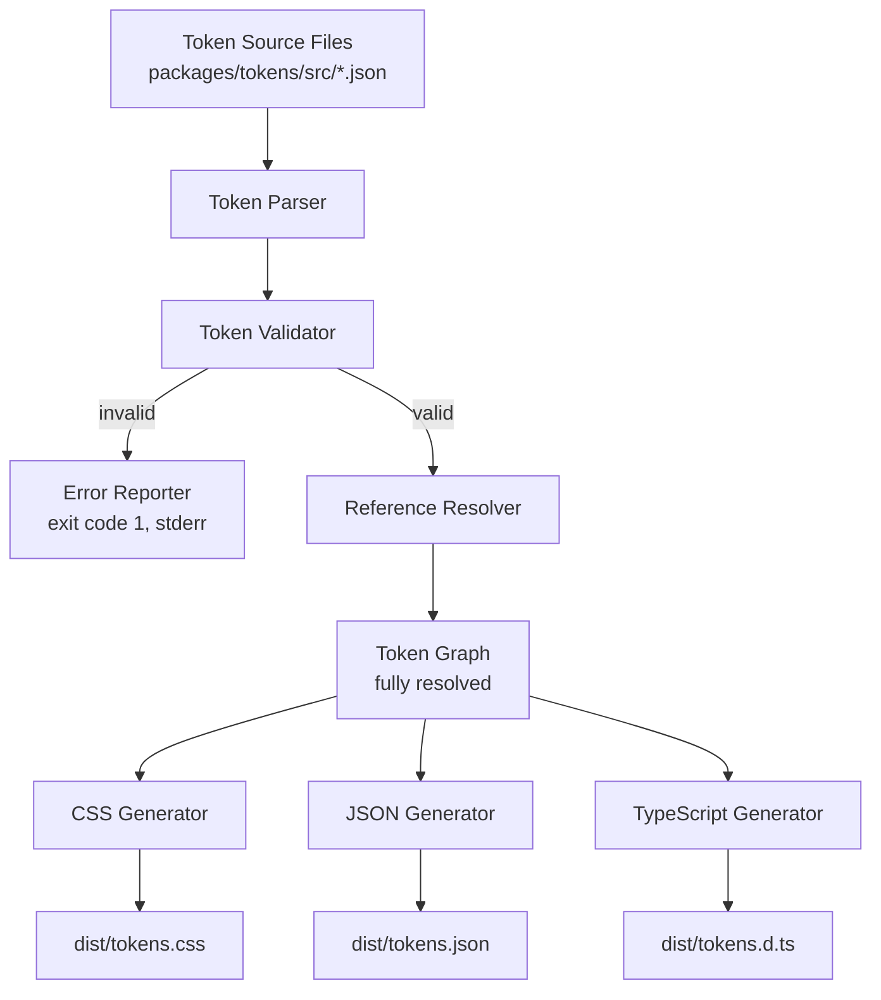

# Design Document: packages/tokens

## Overview

The `packages/tokens` package implements the Design Token pipeline for the Company Design System. It serves as the single build-time tool that reads token JSON source files, validates them, resolves references into a semantic token graph, and generates three output formats: CSS Custom Properties, JSON tokens, and TypeScript type definitions.

This package has zero runtime dependencies. It is a pure build-time tool written in TypeScript, consuming JSON source files and emitting static artifacts to `dist/`.

### Key Design Decisions

1. **Single-pass pipeline** — Parse → Validate → Resolve → Generate all outputs from one resolved graph, guaranteeing all formats stay in sync.
2. **Fail-fast validation** — Any validation error halts the entire build. No partial output is ever emitted.
3. **Deterministic output** — Given the same input tokens, the pipeline always produces byte-identical output files (sorted keys, consistent formatting).
4. **Zero runtime deps** — The package uses only Node.js built-ins and TypeScript at build time. No third-party libraries are bundled.

## Architecture



### Pipeline Stages

| Stage | Input | Output | Failure Mode |
|-------|-------|--------|--------------|
| Parse | JSON files on disk | Raw token tree | Throws on invalid JSON |
| Validate | Raw token tree | Validated token tree | Collects all errors, halts build |
| Resolve | Validated token tree | Resolved token graph | Throws on circular refs |
| Generate CSS | Resolved graph | `.css` file | Write failure (I/O) |
| Generate JSON | Resolved graph | `.json` file | Write failure (I/O) |
| Generate TypeScript | Resolved graph | `.d.ts` file | Write failure (I/O) |

### Directory Structure

```
packages/tokens/
├── src/
│   ├── color.json          # Color token definitions
│   ├── typography.json     # Typography token definitions
│   └── spacing.json        # Spacing token definitions
├── lib/
│   ├── parser.ts           # Token file parser
│   ├── validator.ts        # Token validator
│   ├── resolver.ts         # Reference resolver (builds token graph)
│   ├── generators/
│   │   ├── css.ts          # CSS Custom Property generator
│   │   ├── json.ts         # JSON token generator
│   │   └── typescript.ts   # TypeScript type definition generator
│   ├── types.ts            # Shared type definitions
│   └── build.ts            # Pipeline orchestrator (entry point)
├── dist/                   # Generated output (gitignored)
│   ├── tokens.css
│   ├── tokens.json
│   └── tokens.d.ts
├── __tests__/              # Test files
│   ├── parser.test.ts
│   ├── validator.test.ts
│   ├── resolver.test.ts
│   ├── generators/
│   │   ├── css.test.ts
│   │   ├── json.test.ts
│   │   └── typescript.test.ts
│   └── properties.test.ts  # Property-based tests
├── package.json
├── tsconfig.json
└── vitest.config.ts
```

## Components and Interfaces

### Token Parser (`lib/parser.ts`)

Reads JSON files from disk and produces a raw token tree.

```typescript
interface ParseResult {
  tokens: RawTokenTree;
  filePaths: string[];
}

function parseTokenFiles(srcDir: string): ParseResult;
```

Responsibilities:
- Read all `.json` files from the source directory
- Parse each file as JSON (throw on syntax errors with file path context)
- Merge all category trees into a unified `RawTokenTree`
- Identify leaf nodes (objects with `value` and `type` fields)
- Derive token identifiers from nested key paths

### Token Validator (`lib/validator.ts`)

Validates the raw token tree against all rules before resolution.

```typescript
interface ValidationError {
  tokenIdentifier: string;
  rule: string;
  message: string;
}

interface ValidationResult {
  valid: boolean;
  errors: ValidationError[];
}

function validateTokens(tree: RawTokenTree): ValidationResult;
```

Validation rules enforced:
1. Naming convention compliance (`{category}.{group}[.{variant}][.{property}]`)
2. Required fields (`value` and `type` present on every leaf)
3. Type value is a recognized token type
4. References point to existing tokens
5. Referenced tokens have compatible types
6. No circular references
7. No duplicate identifiers within a category

### Reference Resolver (`lib/resolver.ts`)

Resolves all token references to produce a fully-resolved graph.

```typescript
interface ResolvedToken {
  identifier: string;
  value: string | number;
  type: TokenType;
  originalValue: string | number;
}

type TokenGraph = Map<string, ResolvedToken>;

function resolveReferences(tree: RawTokenTree): TokenGraph;
```

Responsibilities:
- Detect reference syntax (`{...}`) in token values
- Perform topological sort of token dependencies
- Resolve references depth-first to final literal values
- Throw on circular references (should be caught by validator, but defense-in-depth)

### CSS Generator (`lib/generators/css.ts`)

Transforms the resolved token graph into CSS Custom Properties.

```typescript
function generateCSS(graph: TokenGraph): string;
```

Output format:
```css
:root {
  --ds-color-primary-main: #1565C0;
  --ds-color-primary-contrast: #FFFFFF;
  --ds-typography-body-md-font-family: 'Inter', sans-serif;
  --ds-spacing-4: 1rem;
}
```

Naming transform: Token identifier dots → hyphens, camelCase → kebab-case, prefixed with `--ds-`.

### JSON Generator (`lib/generators/json.ts`)

Transforms the resolved token graph into a JSON file preserving nested structure.

```typescript
function generateJSON(graph: TokenGraph): string;
```

Output preserves the hierarchical structure with `value` and `type` fields, but all references are replaced with resolved literal values.

### TypeScript Generator (`lib/generators/typescript.ts`)

Transforms the resolved token graph into TypeScript type definitions.

```typescript
function generateTypeScript(graph: TokenGraph): string;
```

Output format:
```typescript
export interface DesignTokens {
  color: {
    primary: {
      main: string;
      contrast: string;
    };
    // ...
  };
  typography: {
    body: {
      md: {
        fontFamily: string;
        fontSize: string;
        fontWeight: number;
        lineHeight: number;
      };
    };
  };
  spacing: {
    "4": string;
    // ...
  };
}

export declare const tokens: DesignTokens;
```

### Build Pipeline (`lib/build.ts`)

Orchestrates the full pipeline.

```typescript
interface BuildOptions {
  srcDir: string;
  outDir: string;
}

async function build(options: BuildOptions): Promise<void>;
```

Entry point for the `build` script. Coordinates:
1. Parse all source files
2. Validate the token tree
3. On validation failure: print errors to stderr, exit with code 1
4. Resolve all references
5. Generate all three output formats
6. Write output files to `outDir`

## Data Models

### Token Types

```typescript
type TokenType =
  | 'color'
  | 'dimension'
  | 'fontFamily'
  | 'fontWeight'
  | 'duration'
  | 'cubicBezier'
  | 'number'
  | 'shadow';

interface RawToken {
  value: string | number;
  type: TokenType;
}

// A tree where leaves are RawToken and branches are nested objects
type RawTokenTree = {
  [key: string]: RawToken | RawTokenTree;
};

interface ResolvedToken {
  identifier: string;       // e.g., "color.primary.main"
  value: string | number;   // Fully resolved literal value
  type: TokenType;
  originalValue: string | number; // Original value (may be a reference)
  path: string[];           // e.g., ["color", "primary", "main"]
}

type TokenGraph = Map<string, ResolvedToken>;
```

### Validation Error Model

```typescript
interface ValidationError {
  tokenIdentifier: string;   // Which token failed
  rule: ValidationRule;      // Which rule was violated
  message: string;           // Human-readable explanation
  filePath?: string;         // Source file (for JSON parse errors)
}

type ValidationRule =
  | 'naming-convention'
  | 'missing-value'
  | 'missing-type'
  | 'invalid-type'
  | 'reference-not-found'
  | 'reference-type-mismatch'
  | 'circular-reference'
  | 'duplicate-identifier'
  | 'invalid-json';
```

### CSS Name Transform

The transform from token identifier to CSS Custom Property name:
1. Start with token identifier: `typography.body.md.fontSize`
2. Replace dots with hyphens: `typography-body-md-fontSize`
3. Convert camelCase to kebab-case: `typography-body-md-font-size`
4. Prefix with `--ds-`: `--ds-typography-body-md-font-size`

## Correctness Properties

*A property is a characteristic or behavior that should hold true across all valid executions of a system — essentially, a formal statement about what the system should do. Properties serve as the bridge between human-readable specifications and machine-verifiable correctness guarantees.*

### Property 1: Parse round-trip

*For any* valid token source JSON structure, parsing the JSON into the in-memory token tree and then serializing that tree back to JSON SHALL produce a structure semantically equivalent to the original input (same tokens, same values, same types, same hierarchy).

**Validates: Requirements 1.1, 1.4, 1.5, 9.1**

### Property 2: Structural validation correctness

*For any* token object, the validator SHALL accept it if and only if it has a valid naming convention identifier (`{category}.{group}[.{variant}][.{property}]`), contains both `value` and `type` fields, and the `type` is one of the recognized token types. Tokens violating any of these rules SHALL be rejected with an appropriate error.

**Validates: Requirements 2.1, 2.2, 2.3**

### Property 3: Reference integrity validation

*For any* token collection containing references, the validator SHALL accept a reference if and only if the referenced token exists in the collection AND the referenced token has the same `type` as the referencing token. Additionally, for any token dependency graph containing a cycle, the validator SHALL detect and reject it.

**Validates: Requirements 2.4, 2.5, 2.6**

### Property 4: Resolution completeness

*For any* valid token collection (passing all validation rules), after reference resolution, no token value in the resolved graph SHALL contain reference syntax (`{...}`). Every value in the output graph SHALL be a literal.

**Validates: Requirements 3.1, 3.2, 3.3, 5.3**

### Property 5: Invalid input produces no output

*For any* token collection that fails validation, the build pipeline SHALL produce zero output files. The number of files written to the output directory SHALL be exactly zero when validation errors exist.

**Validates: Requirements 2.9**

### Property 6: CSS naming transform correctness

*For any* token identifier, the CSS Custom Property name SHALL equal `--ds-` followed by the identifier with dots replaced by hyphens and camelCase segments converted to kebab-case. This transform is bijective — given a CSS Custom Property name, the original token identifier is derivable.

**Validates: Requirements 4.2, 4.3**

### Property 7: CSS output completeness

*For any* resolved token graph with N tokens, the generated CSS output SHALL contain exactly N CSS Custom Property declarations, one for each token in the graph.

**Validates: Requirements 4.1, 9.3**

### Property 8: JSON output preservation

*For any* valid token source collection, after the full pipeline (parse → validate → resolve → generate JSON), the JSON output SHALL contain every token from the source with its fully-resolved value and `type` field intact, preserving the original nested object hierarchy.

**Validates: Requirements 5.1, 5.2, 5.4, 9.2**

### Property 9: TypeScript type mapping correctness

*For any* resolved token, the TypeScript type definition SHALL map `color`, `dimension`, and `fontFamily` types to `string`, and `fontWeight` and `number` types to `number`. The generated interface hierarchy SHALL mirror the token nesting structure.

**Validates: Requirements 6.2, 6.3, 6.4, 6.5, 6.6, 6.7**

## Error Handling

### Error Categories

| Category | Trigger | Behavior |
|----------|---------|----------|
| JSON Parse Error | Malformed JSON in source file | Report file path and parse error message; halt immediately |
| Validation Error | Token fails any validation rule | Collect all validation errors; report all; halt before resolution |
| Circular Reference | Token dependency graph has a cycle | Report all tokens in the cycle; halt |
| I/O Error | Cannot read source or write output | Report path and OS error; halt with non-zero exit |

### Error Reporting Format

All errors are written to stderr in a structured format:

```
[ERROR] <file_path>: <rule> - <message>
  Token: <token_identifier>
```

Example:
```
[ERROR] src/color.json: reference-not-found - Referenced token "color.brand.main" does not exist
  Token: color.primary.main
```

### Fail-Fast Behavior

- JSON parse errors halt immediately (cannot continue without valid input)
- Validation collects ALL errors before halting (gives developer full picture)
- Resolution errors halt immediately (circular ref detection is pass/fail)
- I/O errors halt immediately (cannot recover from file system failures)

### Exit Codes

| Code | Meaning |
|------|---------|
| 0 | Success — all outputs generated |
| 1 | Validation failure — errors reported to stderr |
| 2 | I/O error — file read/write failure |

## Testing Strategy

### Property-Based Tests (fast-check)

Property-based testing is well-suited for this package because:
- The parser, validator, and generators are pure functions with clear input/output behavior
- Token structures have a large input space (nested objects, various types, references)
- Universal properties exist (round-trips, invariants, correctness guarantees)
- All operations are in-memory and fast (cost-effective to run 100+ iterations)

**Library**: fast-check (already in root devDependencies)
**Configuration**: Minimum 100 iterations per property test
**Tag format**: `Feature: tokens-package, Property {N}: {title}`

Each correctness property from the design maps to a single property-based test:

| Property | Test Focus | Generator Strategy |
|----------|-----------|-------------------|
| 1: Parse round-trip | Parser | Generate random valid token JSON trees |
| 2: Structural validation | Validator | Generate tokens with valid/invalid structures |
| 3: Reference integrity | Validator | Generate token graphs with valid/invalid references |
| 4: Resolution completeness | Resolver | Generate valid token sets with references |
| 5: No output on failure | Pipeline | Generate invalid token sets |
| 6: CSS naming transform | CSS Generator | Generate random token identifiers |
| 7: CSS completeness | CSS Generator | Generate resolved graphs of random size |
| 8: JSON preservation | JSON Generator | Generate valid token collections |
| 9: TypeScript type mapping | TS Generator | Generate tokens of each type |

### Unit Tests (vitest)

Unit tests complement property tests by verifying specific examples and edge cases:

- **Parser**: Empty files, files with only branch nodes, deeply nested structures
- **Validator**: Each validation rule with a minimal failing example
- **Resolver**: Single reference, multi-level chain, diamond references
- **CSS Generator**: Specific output format verification, `:root` wrapper
- **JSON Generator**: Pretty-print formatting, specific value formats
- **TypeScript Generator**: Export statement format, interface syntax

### Integration Tests

- Full pipeline end-to-end with sample token files
- Build script exit code verification
- Output file existence and content checks

