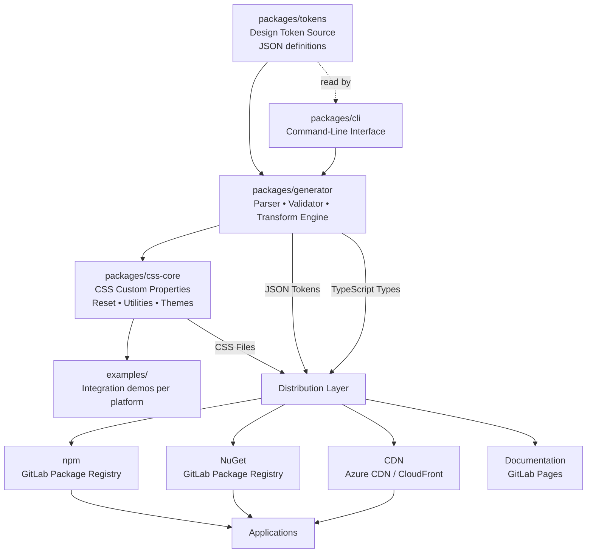

# Architecture

Version: 1.0.0

Status: Draft

---

## Monorepo Layout

The Design System Platform is organized as a monorepo with four core packages under `packages/`:

| Package | Responsibility |
|---|---|
| `packages/tokens` | Authored Design Token definitions (JSON). Single source of truth for every visual value. |
| `packages/css-core` | Generated CSS output — reset/base layer, utility classes, pre-composed component classes (`.btn`, `.card`, `.badge`, `.input`, `.alert`, `.table`, `.modal`, `.nav`, `.tabs`), table presentation states for sorting/filtering/pagination, theme files, and CSS Custom Properties derived from tokens. |
| `packages/generator` | Token parser, validator, semantic graph resolver, and transform engine. Reads tokens, produces all output formats. |
| `packages/cli` | Command-line interface wrapping the generator for local development and CI/CD invocation. |

Each package has a single responsibility and remains loosely coupled. Dependencies flow in one direction: `tokens` → `generator` → `css-core`, with `cli` orchestrating the pipeline.

---

## Data Flow

Design Token definitions flow through the generator tooling to produce CSS and other output artifacts:

```text
Design Token Source (packages/tokens/*.json)
        │
        ▼
Token Parser & Validator (packages/generator)
        │
        ├── invalid → build fails, no output emitted
        │
        ▼ valid
Semantic Token Graph (resolved references + aliases)
        │
        ▼
Transform Engine (packages/generator)
        │
        ├── CSS Custom Properties → packages/css-core
        ├── JSON Tokens
        ├── TypeScript Types
        └── Theme Files (light / dark / brand)
```

1. **Token Source** — Design Tokens are authored as structured JSON under `packages/tokens/`. This is the single point of entry; no visual value may be introduced downstream.
2. **Validation** — The generator reads every token file and validates it against naming conventions and schema rules. A failing token halts the build entirely — no partial output is produced.
3. **Semantic Graph** — Valid tokens are resolved into an in-memory graph. Aliases and semantic references (e.g. `color.primary` → `palette.blue.600`) are fully resolved so every downstream format receives both resolved values and semantic names.
4. **Transform** — The engine walks the graph once and emits one output per target format in the same build step, guaranteeing outputs never drift from one another.
5. **CSS Core** — CSS Custom Properties land in `packages/css-core`, which also houses the reset/base layer, utility classes, a components layer (pre-composed classes like `.btn`/`.card`/`.badge`/`.input`/`.alert`/`.table`/`.modal`/`.nav`/`.tabs` that combine multiple token references into reusable classes — see [docs/spec/components.md](spec/components.md)), and theme stylesheets generated from those properties. Table sorting, filtering, and pagination are exposed as CSS presentation states; application logic remains framework-owned. The CSS layer order is reset → base → utilities → components → theme.

---

## Platform Consumption

Each Supported Platform consumes the generated output through the mechanism best suited to its ecosystem:

| Platform | Consumption Method |
|---|---|
| React | Import CSS from npm package; TypeScript types for token autocomplete |
| Next.js | Import CSS in `app/layout`; TypeScript types; build-time theme selection |
| Vue | Import CSS from npm package; JSON tokens for tooling integration |
| Angular | Import CSS via `angular.json` styles array; TypeScript types |
| Svelte | Import CSS in root layout; JSON tokens for preprocessor plugins |
| Blazor | NuGet package containing CSS + static assets |
| ASP.NET MVC / Razor | NuGet package; CSS linked via `<link>` in `_Layout.cshtml` |
| Laravel | npm package or CDN link in Blade templates |
| Plain HTML | CDN `<link>` tag; no build step required |

All platforms receive the same Design Token values — the only difference is the delivery mechanism (npm, NuGet, or CDN) and whether the consumer also uses the TypeScript types or JSON token files.

---

## Package Relationship Diagram



---

## Top-Level Directories

| Directory | Responsibility |
|---|---|
| `examples/` | Integration demonstrations showing how each Supported Platform consumes the generated output. Used for local verification, visual regression testing, and as living documentation for adopters. |
| `docs/` | The canonical Documentation Set (`00-index.md` through `12-contributing.md`), plus deep-reference specifications (`docs/spec/`), architectural diagrams (`docs/diagrams/`), and operational documents (`CHANGELOG.md`, `CONTRIBUTING.md`, `ROADMAP.md`). |

---

## Supersedes / Deep Reference

This document is a condensed architectural overview. For full detail, refer to:

- [ARCHITECTURE.md](../ARCHITECTURE.md) — the authoritative, comprehensive architecture reference covering high-level design, CSS architecture, theme architecture, security principles, performance budgets, testing strategy, and governance rules.
- [docs/diagrams/design-token-flow.md](diagrams/design-token-flow.md) — detailed stage-by-stage Mermaid diagram of the Design Token pipeline from source through distribution to application consumption.
