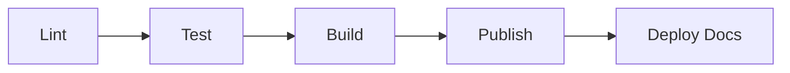

# 10 — CI/CD Pipeline

This document describes the continuous integration and continuous delivery pipeline for the Design System Platform. The pipeline runs on **GitLab CI** and is defined in the repository root file `.gitlab-ci.yml`.

All stages execute sequentially on every Merge Request. No package is published unless every preceding quality gate passes.

---

## Lint Stage

The lint stage validates code quality and documentation integrity before any tests run.

Checks performed:

- **Code linting** — ESLint across all packages (`packages/tokens`, `packages/css-core`, `packages/generator`, `packages/cli`)
- **Documentation link validation** — the Link_Validator script (`scripts/validate-links.mjs`) verifies that every internal link resolves to an existing file, no documentation file is orphaned from the index, and the index ordering is correct
- **Style linting** — Stylelint for generated CSS outputs

The documentation lint check is invoked via:

```bash
pnpm run lint:docs
# equivalent to: node scripts/validate-links.mjs
```

This ensures documentation consistency is a first-class CI gate, not a manual review step.

---

## Test Stage

The test stage runs after lint passes and executes two categories of tests:

### Unit Tests

- Token validation and transformation logic
- CSS generation correctness
- Generator output verification
- CLI argument parsing and error handling

```bash
pnpm run test
# equivalent to: vitest run
```

### Visual Regression Tests

- Snapshot comparison of generated CSS rendered in browser environments
- Detection of unintended visual changes across themes (Light, Dark, Corporate)
- Pixel-level comparison for spacing, typography, and color token outputs

Visual regression tests prevent silent regressions in the generated styling artifacts that unit tests alone cannot catch.

---

## Build Stage

The build stage compiles all packages in dependency order:

```text
tokens → css-core → generator → cli
```

Build steps:

1. Compile Design Token definitions into output formats (CSS Custom Properties, JSON, TypeScript types, theme files)
2. Generate the CSS framework from compiled tokens
3. Build the generator tooling
4. Build the CLI distribution

A **bundle size check** runs at the end of this stage, verifying outputs remain within the performance budget:

| Asset       | Target          |
| ----------- | --------------- |
| Core CSS    | < 50 KB (gzip)  |
| Utility CSS | < 100 KB (gzip) |
| Theme CSS   | < 20 KB (gzip)  |

Build failures or budget violations block progression to the publish stage.

---

## Publish Stage

The publish stage distributes built artifacts to all configured channels. Each channel corresponds to a Distribution Channel defined in [docs/09-publish.md](./09-publish.md):

| Channel | Registry / Target | Package |
| ------- | ----------------- | ------- |
| **npm** | GitLab Package Registry | `@company/design-tokens`, `@company/css-core`, `@company/generator`, `@company/cli` |
| **NuGet** | GitLab Package Registry | `Company.DesignSystem.Tokens`, `Company.DesignSystem.Css` |
| **CDN** | Azure CDN / CloudFront | Compiled CSS bundles, token JSON, theme files |
| **GitLab Pages** | GitLab Pages | Documentation site |

Publishing is gated by:

- All lint checks passed
- All unit tests passed
- All visual regression tests passed
- Build completed without errors
- Bundle size within budget

Packages follow Semantic Versioning. Only tagged releases on the default branch trigger the publish stage — Merge Request pipelines skip this stage.

---

## Deploy-Docs Stage

The deploy-docs stage publishes the documentation site to GitLab Pages after all packages are successfully published.

Deployment steps:

1. Build the documentation site from `docs/` source files
2. Deploy to GitLab Pages
3. Invalidate CDN cache for documentation assets (if applicable)

The documentation site provides:

- The full Documentation Set (`docs/00-index.md` through `docs/12-contributing.md`)
- API reference for generated tokens and utilities
- Theme previews and examples

---

## Stage Order

The pipeline stages execute in strict sequential order:

```text
lint → test → build → publish → deploy-docs
```



Each stage acts as a quality gate. Failure at any stage halts the pipeline and prevents subsequent stages from executing. This guarantees:

- No untested code is built
- No unbuilt artifacts are published
- No broken documentation is deployed

---

## Pipeline Configuration

The pipeline is defined in **`.gitlab-ci.yml`** located at the **repository root**.

```text
Repository/
├── .gitlab-ci.yml    ← pipeline definition
├── packages/
├── docs/
└── scripts/
```

This file is the single source of truth for all CI/CD stage definitions, job configurations, and environment variables. Changes to the pipeline require the same Merge Request review process as code changes.

---

## References

- [ARCHITECTURE.md](../ARCHITECTURE.md) — CI/CD Pipeline section
- [docs/09-publish.md](./09-publish.md) — Distribution channels and versioning policy
