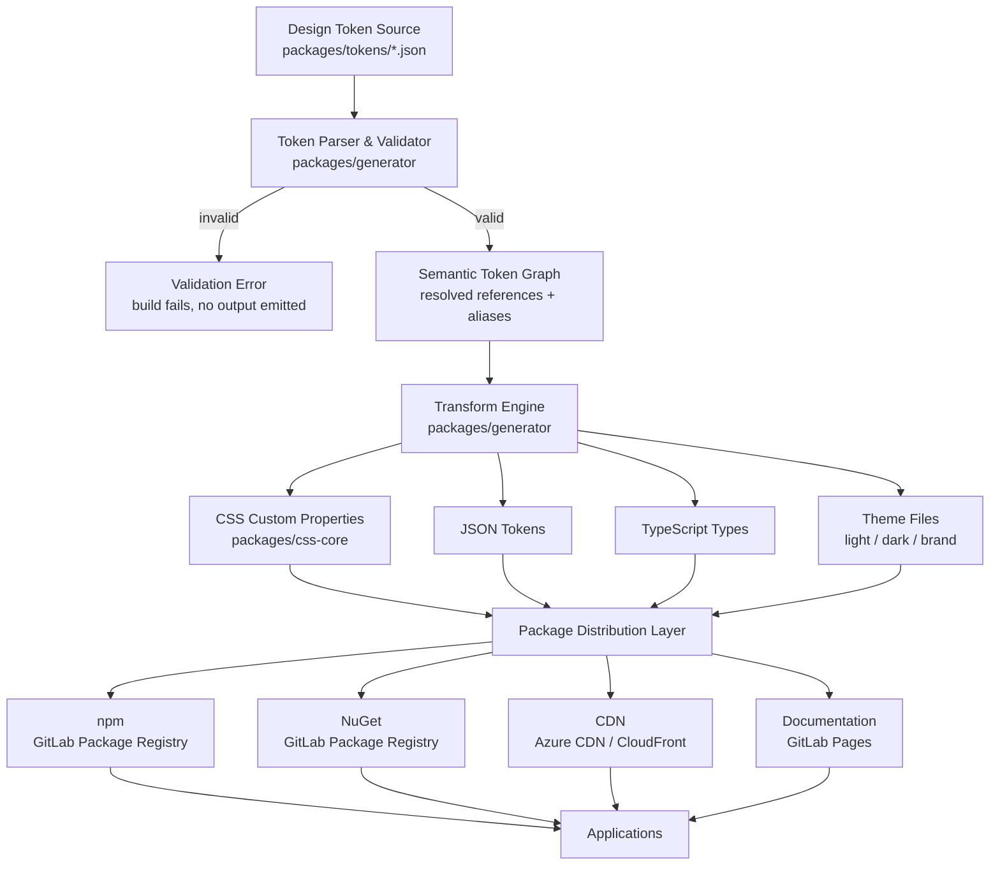

# Design Token Flow

Version: 1.0.0

Status: Draft

---

# Purpose

This diagram illustrates how a single Design Token definition travels from its
authored source to every distributable artifact consumed by applications.

It expands on the high-level flow shown in [ARCHITECTURE.md](../../ARCHITECTURE.md)
with package-level detail, and complements
[docs/spec/design-tokens.md](../spec/design-tokens.md) (token structure) and
[docs/spec/naming.md](../spec/naming.md) (naming rules).

---

# Flow Diagram

---

# Stage Descriptions

## 1. Design Token Source

Design Tokens are authored as structured files (see
[docs/spec/design-tokens.md](../spec/design-tokens.md) for the exact file
format) under `packages/tokens/`. This is the single point of entry — no
visual value may be introduced downstream of this stage.

Categories: Palette, Typography, Spacing, Shape, Shadows, Breakpoints,
Motion, Opacity, Elevation, Z-index.

## 2. Token Parser & Validator

`packages/generator` reads every token file and validates it against the
naming convention and schema rules before anything is generated.

A token that fails validation halts the build for that token set. No partial
or best-effort output is produced — see the Security Principles in
[ARCHITECTURE.md](../../ARCHITECTURE.md).

## 3. Semantic Token Graph

Valid tokens are resolved into an in-memory graph. This step resolves
aliases and semantic references (e.g. `color.primary` → `palette.blue.600`)
so that every downstream output receives fully-resolved values as well as
the semantic name.

## 4. Transform Engine

The transform engine walks the resolved graph once and emits one output per
target format. All formats are generated from the same graph in the same
build step, guaranteeing they never drift from one another.

## 5. Output Artifacts

| Artifact | Consumed by |
|---|---|
| CSS Custom Properties | `packages/css-core`, all Supported Platforms |
| JSON Tokens | Tooling, design tools, non-JS platforms |
| TypeScript Types | React, Next.js, Angular, Vue, Svelte |
| Theme Files | Theme Engine (light/dark/brand switching) |

## 6. Package Distribution Layer

Artifacts are packaged for each Distribution Channel without modification —
distribution never transforms token values, it only repackages the outputs
from stage 5.

## 7. Applications

Applications consume a Distribution Channel appropriate to their platform
and never define visual constants directly, per the Design Tokens First
principle in [AGENTS.md](../../AGENTS.md).

---

# Related Documents

* [ARCHITECTURE.md](../../ARCHITECTURE.md) — high-level system architecture
* [docs/spec/design-tokens.md](../spec/design-tokens.md) — token file format and validation rules
* [docs/spec/naming.md](../spec/naming.md) — naming convention applied at the validation stage
* [docs/DESIGN-PHILOSOPHY.md](../DESIGN-PHILOSOPHY.md) — rationale for the Design Tokens First principle
